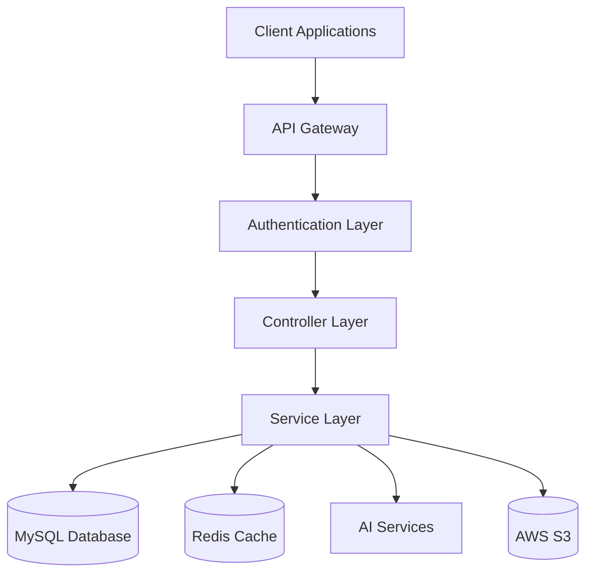
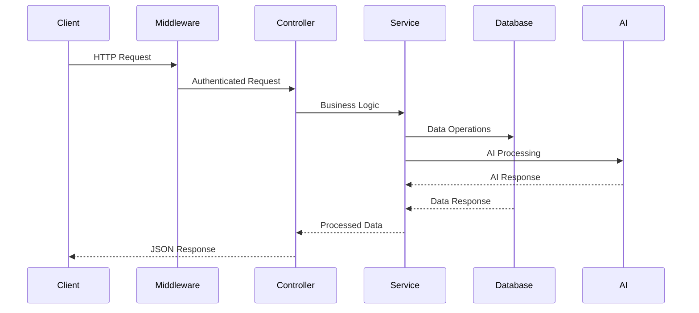

# System Patterns: Hintword API

## Architecture Overview

Hintword API follows a **layered microservice architecture** with clear separation of concerns, designed for scalability and maintainability.



## Core Architectural Patterns

### 1. Layered Architecture

#### Controller Layer (`app/controllers/`)
- **Purpose**: Handle HTTP requests and responses
- **Responsibilities**: Request validation, response formatting, error handling
- **Pattern**: RESTful API design with versioning (`/v1/`)
- **Key Controllers**:
  - `auth/`: Authentication and user management
  - `note/`: Note CRUD operations
  - `tab/`: Tab and collection management
  - `agent/`: AI agent interactions

#### Service Layer (`app/services/`)
- **Purpose**: Business logic and orchestration
- **Responsibilities**: Data processing, AI integration, business rules
- **Pattern**: Service-oriented design with dependency injection
- **Key Services**:
  - `user/`: User management and authentication
  - `agent/`: AI processing and completion
  - `oauth/`: OAuth integration (Google)

#### Data Layer (`app/models/`, `app/database/`)
- **Purpose**: Data persistence and access
- **Responsibilities**: Database operations, data modeling, migrations
- **Pattern**: Repository pattern with GORM ORM
- **Key Components**:
  - Models: `Notes`, `Users`, `Tabs`, `Collections`
  - Database: MySQL with connection pooling
  - Migrations: Version-controlled schema changes

### 2. Factory Pattern

#### Service Factory (`app/factory/`)
- **Purpose**: Abstract service implementations
- **Pattern**: Factory pattern for external service integration
- **Implementations**:
  - `cloud_storage/`: S3 storage abstraction
  - `email_provider/`: SendGrid email service
  - `sms_provider/`: MSG91 SMS service

```go
// Example Factory Pattern
type CloudStorage interface {
    UploadFile(file []byte, path string) error
    GetFile(path string) ([]byte, error)
}

type S3Storage struct {
    client *s3.Client
}
```

### 3. Middleware Pattern

#### Request Middleware (`app/middlewares/`)
- **Purpose**: Cross-cutting concerns and request processing
- **Pattern**: Chain of responsibility
- **Key Middlewares**:
  - `auth.go`: JWT authentication and authorization
  - `logger.go`: Request logging and monitoring

```go
// Middleware Chain Example
app.Use(logger.New())
app.Use(cors.New(cors.Config{...}))
app.Use(middlewares.OptionalAuth())
```

### 4. Configuration Pattern

#### Environment-Based Configuration (`app/configs/`)
- **Purpose**: Environment-specific configuration management
- **Pattern**: Strategy pattern for configuration loading
- **Strategies**:
  - Local: `.env` file loading
  - AWS SSM: Parameter Store integration
  - Production: Secure configuration management

```go
// Configuration Strategy
switch envMethod {
case constants.EnvLoadMethodLocal:
    cfg.LoadLocalConfig()
case constants.EnvLoadMethodSSM:
    cfg.LoadSSMConfig()
}
```

## Data Flow Patterns

### 1. Request Processing Flow



### 2. AI Integration Pattern

#### AI Service Integration
- **Pattern**: Adapter pattern for AI service abstraction
- **Implementation**: OpenAI API integration with fallback strategies
- **Error Handling**: Graceful degradation when AI services unavailable

```go
// AI Service Pattern
type AIService interface {
    ProcessContent(content string) (*AIResponse, error)
    GenerateCompletion(prompt string) (*CompletionResponse, error)
}
```

### 3. Real-time Communication

#### WebSocket Integration (`app/routes/websocket.go`)
- **Pattern**: Publisher-subscriber for real-time updates
- **Use Cases**: Live collaboration, real-time notifications
- **Implementation**: Fiber WebSocket middleware

## Security Patterns

### 1. Authentication & Authorization

#### JWT-Based Authentication
- **Pattern**: Stateless authentication with JWT tokens
- **Implementation**: Access and refresh token strategy
- **Security**: Token validation, expiration, and refresh

```go
// JWT Middleware Pattern
func RequireLoggedIn() fiber.Handler {
    return func(c *fiber.Ctx) error {
        // JWT validation logic
    }
}
```

#### OAuth Integration
- **Pattern**: OAuth 2.0 flow for third-party authentication
- **Implementation**: Google OAuth integration
- **Security**: Secure token exchange and user data protection

### 2. Data Security

#### Input Validation
- **Pattern**: Request validation with custom validators
- **Implementation**: Go validator with custom rules
- **Security**: SQL injection prevention, XSS protection

#### Data Encryption
- **Pattern**: Encryption at rest and in transit
- **Implementation**: HTTPS, database encryption, secure storage

## Scalability Patterns

### 1. Database Patterns

#### Connection Pooling
- **Pattern**: Database connection pool management
- **Implementation**: GORM with connection pooling
- **Benefits**: Efficient resource utilization, connection reuse

#### Migration Management
- **Pattern**: Version-controlled database schema changes
- **Implementation**: Goose migration tool
- **Benefits**: Safe schema evolution, rollback capabilities

### 2. Caching Patterns

#### Redis Integration
- **Pattern**: Distributed caching for performance
- **Implementation**: Redis for session storage and caching
- **Benefits**: Reduced database load, improved response times

### 3. Cloud Integration

#### AWS Services Integration
- **Pattern**: Cloud-native service integration
- **Services**: ECR (container registry), SSM (parameter store), S3 (storage)
- **Benefits**: Scalable infrastructure, managed services

## Error Handling Patterns

### 1. Centralized Error Handling

#### Error Response Pattern
- **Pattern**: Consistent error response format
- **Implementation**: Structured error responses with HTTP status codes
- **Benefits**: Predictable error handling, better debugging

```go
// Error Response Pattern
type ErrorResponse struct {
    Code    int    `json:"code"`
    Message string `json:"message"`
    Details string `json:"details,omitempty"`
}
```

### 2. Logging Patterns

#### Structured Logging
- **Pattern**: Consistent logging format across the application
- **Implementation**: Logrus with structured logging
- **Benefits**: Better debugging, monitoring, and analysis

## Deployment Patterns

### 1. Containerization

#### Docker Pattern
- **Pattern**: Containerized application deployment
- **Implementation**: Multi-stage Docker builds
- **Benefits**: Consistent environments, easy deployment

### 2. CI/CD Patterns

#### GitHub Actions Integration
- **Pattern**: Automated build, test, and deployment
- **Implementation**: GitHub Actions workflow
- **Benefits**: Automated deployment, quality gates

```yaml
# CI/CD Pattern
- name: Build and Deploy
  run: |
    docker build -t $ECR_REGISTRY/$ECR_REPOSITORY:$IMAGE_TAG
    docker push $ECR_REGISTRY/$ECR_REPOSITORY:$IMAGE_TAG
```

### 3. Infrastructure as Code

#### AWS Integration
- **Pattern**: Cloud infrastructure automation
- **Implementation**: AWS CLI and SDK integration
- **Benefits**: Reproducible infrastructure, automated scaling

## Performance Patterns

### 1. Async Processing

#### Background Jobs
- **Pattern**: Asynchronous processing for heavy operations
- **Implementation**: Goroutine-based background processing
- **Benefits**: Non-blocking operations, better user experience

### 2. Resource Optimization

#### Connection Management
- **Pattern**: Efficient resource utilization
- **Implementation**: Connection pooling, resource cleanup
- **Benefits**: Better performance, resource efficiency

## Testing Patterns

### 1. Unit Testing

#### Service Testing
- **Pattern**: Isolated unit tests for business logic
- **Implementation**: Go testing framework with mocks
- **Benefits**: Reliable business logic, faster feedback

### 2. Integration Testing

#### API Testing
- **Pattern**: End-to-end API testing
- **Implementation**: HTTP client testing with test database
- **Benefits**: Full workflow validation, regression prevention

---

*This document defines the architectural patterns and design principles that guide the system's development and evolution.*
